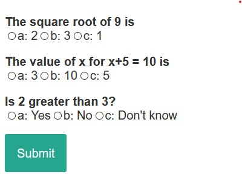

# Simple-JS-quiz
This project deals with all the major tags, attributes, and functions used for creating a quiz. The difficulty level of this project is hard, that means you should have a solid understanding of the basics of HTML and CSS, and in JS you should know how to define functions and use loops in your code, and some methods to modify HTML DOM using JS. Once you know about all this stuff, you are so good to go!

The final image of output is shown below.

You will also be able to display the users' scores after their submissions.

All the resources required to complete this project are provided in this repository. With no changes, the code will work just fine. You yourself can update the code as to suit your requirements.
